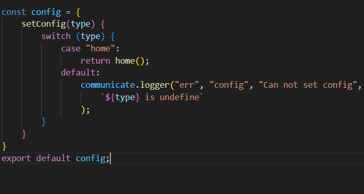

# myCore

# 1. Preview
- myCore give your method to rendering HTML and control event to easer, don't worry, myCore have syntax so basic and you can control this mini libary after your read guild

    - Step 1 : Your create a js file and import this to index.html file
        Example: 
            + In example, I create file name is core.js

    - Step 2 : Your import libary to communicate.js and now, you can use this for every thing you need.
    - Step 3 : Befor do some thing, your need create a file config.js to config you data
        Your need return like this 
            
        * home() is you declare function, you can return you HTML
        * "home" is name you want when you call this, you get data from home() you declare

      + You can config API data if you want

    - Step 4 : Now, you go back core.js file and save you "home" to output
        - Syntax: 
                const home = config.setConfig('home');
                communicate.send('output', home, 'home');
    - Step 5 : Now, you can render this by funtion 
        - Syntax:
                communicate.view_render("body", 'home');

# 2.Syntax 

